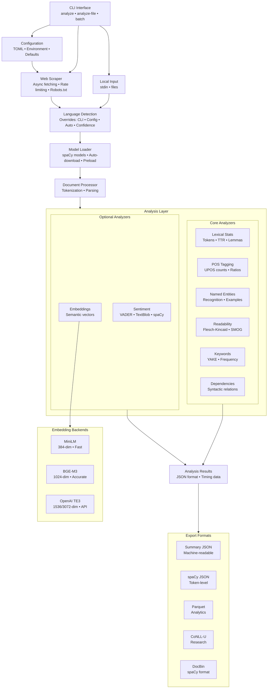

# Rookeen – spaCy-based web linguistic analysis

Rookeen is a spaCy-only pipeline and CLI that fetches web content and runs linguistic analyzers including semantic embeddings, producing structured JSON output for ML and NLP workflows. Features industry-ready Unix pipeline composability with proper exit codes, structured output formats, and advanced data processing tools.

## Table of Contents

- [Architecture Overview](#architecture-overview)
  - [Architecture Components](#architecture-components)
- [Key features](#key-features)
- [Supported languages](#supported-languages)
- [Install](#install)
- [CLI usage](#cli-usage)
- [Quick Pipeline Examples](#quick-pipeline-examples)
  - [Basic Analysis Pipeline](#basic-analysis-pipeline)
  - [Benchmark Pipeline (Industry-Ready)](#benchmark-pipeline-industry-ready)
- [Usage Examples by User Perspective](#usage-examples-by-user-perspective)
  - [1. Hobbyist: Personal Blog Analysis](#1-hobbyist-personal-blog-analysis)
  - [2. Pro-Dev | Researcher: Advanced NLP Research Pipeline](#2-pro-dev--researcher-advanced-nlp-research-pipeline)
  - [3. Team: Collaborative NLP Feature Development](#3-team-collaborative-nlp-feature-development)
  - [4. Enterprise R&D: Large-Scale Production NLP Infrastructure](#4-enterprise-rd-large-scale-production-nlp-infrastructure)
- [Language Detection](#language-detection)
- [Analyzer Selection and Plugin Registry](#analyzer-selection-and-plugin-registry)
  - [Available Analyzers](#available-analyzers)
  - [Selective Analyzer Control](#selective-analyzer-control)
  - [Integration with Existing Flags](#integration-with-existing-flags)
  - [Plugin Registry Architecture](#plugin-registry-architecture)
  - [Use Cases](#use-cases)
  - [Batch Processing with Analyzer Selection](#batch-processing-with-analyzer-selection)
  - [Custom Analyzer Development](#custom-analyzer-development)
- [Configuration](#configuration)
- [Error Handling and Automation](#error-handling-and-automation)
- [JSON output schema (snippet)](#json-output-schema-snippet)
- [Semantic Embeddings](#semantic-embeddings)
  - [Installation for Embeddings](#installation-for-embeddings)
  - [Usage](#usage)
  - [Features](#features)
  - [Applications](#applications)
  - [Output Structure](#output-structure)
  - [Performance](#performance)
  - [CLI Options](#cli-options)
- [Smart Sentiment Analysis](#smart-sentiment-analysis)
  - [Installation for Sentiment Analysis](#installation-for-sentiment-analysis)
  - [Usage](#usage-1)
  - [Library Prioritization](#library-prioritization)
  - [Features](#features-1)
  - [Applications](#applications-1)
  - [Output Structure](#output-structure-1)
  - [Performance](#performance-1)
  - [CLI Option](#cli-option)
- [CoNLL-U Export (UD)](#conll-u-export-ud)
  - [Installation for UD Export](#installation-for-ud-export)
  - [Usage](#usage-2)
  - [Engines](#engines)
  - [Validation Results](#validation-results)
  - [CLI Options](#cli-options-1)
- [Parquet Export (Analyzer Aggregates)](#parquet-export-analyzer-aggregates)
  - [Installation](#installation)
  - [Usage](#usage-3)
  - [CLI Option](#cli-option-1)
- [Unix Pipeline Tools](#unix-pipeline-tools)
  - [Pipeline Tools Features](#pipeline-tools-features)
  - [Pipeline Tools Usage](#pipeline-tools-usage)
  - [Pipeline Tools Output Example](#pipeline-tools-output-example)
- [E2E tests](#e2e-tests)
  - [Test Coverage](#test-coverage)
  - [Quick Commands](#quick-commands)
- [Testing & Benchmarks](#testing--benchmarks)
  - [Get Started: See Rookeen in Action](#get-started-see-rookeen-in-action)
  - [Unit & Integration Tests](#unit--integration-tests)
  - [CLI Validation Scripts](#cli-validation-scripts)
  - [Performance Benchmarks](#performance-benchmarks)
- [Performance Benchmarks](#performance-benchmarks-1)
  - [Benchmark Coverage](#benchmark-coverage)
  - [Industry-Ready Unix Pipeline Composability](#industry-ready-unix-pipeline-composability)
  - [Running Benchmarks](#running-benchmarks)
  - [Compute-Only Local Stdin Benchmark](#compute-only-local-stdin-benchmark)
  - [Example Output](#example-output)
  - [Performance Metrics (Typical)](#performance-metrics-typical)
- [Machine-readable timing and provenance](#machine-readable-timing-and-provenance)
  - [Timing Information](#timing-information)
  - [Per-Analyzer Provenance](#per-analyzer-provenance)
  - [Usage Examples](#usage-examples)
  - [Applications](#applications-2)
- [JSON Schema validation](#json-schema-validation)
- [Scripts and Utilities](#scripts-and-utilities)
  - [Pipeline Tools (`scripts/pipeline_tools.py`)](#pipeline-tools-scriptspipeline_toolspy)
  - [Pipeline Demo (`scripts/pipeline_demo.sh`)](#pipeline-demo-scriptspipeline_demosh)
  - [Validation Scripts](#validation-scripts)
- [Industry-Ready Pipeline Features](#industry-ready-pipeline-features)
  - [Proper Output Separation](#proper-output-separation)
  - [Multiple Output Formats](#multiple-output-formats)
  - [Pipeline-Friendly Flags](#pipeline-friendly-flags)
  - [Advanced Data Processing](#advanced-data-processing)
  - [Real-World Examples](#real-world-examples)
- [Notes](#notes)

## Architecture Overview



### Architecture Components

- **CLI Interface**: Click-based command-line with `analyze`, `analyze-file`, and `batch` commands
- **Configuration System**: Hierarchical settings precedence (CLI flags → Environment variables → TOML files → Defaults)
- **Processing Pipeline**: Linear flow from web scraping through language detection, model loading, and document processing
- **Analyzer System**: Plugin-based architecture with core analyzers (always available) and optional analyzers (require extra dependencies)
- **Export Formats**: Multiple output formats (JSON, Parquet, CoNLL-U, DocBin) for different use cases
- **External Dependencies**: spaCy language models, ML libraries (sentence-transformers, VADER), and specialized parsers (Stanza)
- **Embedding Backends**: Pluggable backends for sentence embeddings (MiniLM, BGE-M3, OpenAI TE3)

The architecture follows a clean vertical flow: **Input → Configuration → Processing → Analysis → Results → Export**

### Key features
- Web page fetching with retries and HTML sanitization
- Language detection and spaCy model loading with auto-download
- **Flexible analyzer selection** with selective enable/disable for cost optimization
- **Plugin-based architecture** with extensible analyzer registry
- **Industry-ready Unix pipeline composability** with structured output and proper exit codes
- Analyzers: lexical stats, POS, NER, readability, keywords, **embeddings**, **sentiment**
- **Semantic embeddings** for similarity, clustering, and semantic search
- **Smart sentiment analysis** with library prioritization (VADER → TextBlob → spaCy)
- **Performance benchmark harness** for latency tracking and regression detection
- **Advanced pipeline tools** for data analysis and filtering
- **Machine-readable timing and provenance** for SLA monitoring and performance tracking
- **JSON Schema validation** for contract-first development and data consistency
- JSON output suitable for programmatic consumption and ML pipelines

### Supported languages
- en → `en_core_web_sm` (included by default)
- de → `de_core_news_sm` (optional extra)
- es → `es_core_news_sm` (optional extra)
- fr → `fr_core_news_sm` (optional extra)

### Install
Rookeen is managed with **uv** (dependency and environment management) and uses **ruff** for linting.
After syncing, a console script named `rookeen` is available.

[`uv`](https://docs.astral.sh/uv/getting-started/installation/) and [`ruff`](https://docs.astral.sh/ruff/installation/) can be installed in many ways; click and see their documentation if you have not them alredy.

```bash
# Core installation (includes English model)
uv sync

# Install with all extras (includes all language models)
uv sync --group dev --all-extras

# Optional: Add specific language models
uv sync --extra lang-de  # German
uv sync --extra lang-es  # Spanish
uv sync --extra lang-fr  # French

# Optional: Add embeddings support
uv sync --extra embeddings
# (includes sentence-transformers and OpenAI SDK for API backends)

# Optional: Add sentiment analysis support
uv sync --extra sentiment

# Optional: Add UD CoNLL-U export support
uv sync --extra ud

# Optional: Add Parquet export support
uv sync --extra parquet

# Combine multiple extras
uv sync --extra embeddings --extra sentiment --extra lang-de --extra lang-fr
```

Models are auto-downloaded by the CLI when missing if you pass `--models-auto-download` (enabled by default). No extra script is required.

To install models manually instead:
```bash
# Example for German
uv pip install de-core-news-sm
# or
python -m spacy download de_core_news_sm
```

### CLI usage
You can invoke the CLI in any of these equivalent ways (recommended first):

- uv run rookeen <command> [options]
- uv run python -m rookeen <command> [options]
- uv run python -m rookeen.cli <command> [options]

Analyze a URL:
```bash
uv run rookeen analyze "https://en.wikipedia.org/w/index.php?title=Natural_language_processing&oldid=1201524046" \
  --format json --models-auto-download --lang en --robots ignore -o results/nlp.json
```

Analyze a URL with embeddings:
```bash
uv run rookeen analyze "https://en.wikipedia.org/wiki/Cat" \
  --enable-embeddings --models-auto-download --robots ignore -o results/cat_analysis.json
```

Select an embeddings backend explicitly (MiniLM local):
```bash
uv run rookeen analyze "https://en.wikipedia.org/wiki/Cat" \
  --enable-embeddings --embeddings-backend miniLM --models-auto-download -o results/cat_minilm.json
```

Use the BGE-M3 backend (local, HF model id):
```bash
uv run rookeen analyze "https://en.wikipedia.org/wiki/Cat" \
  --enable-embeddings --embeddings-backend bge-m3 --embeddings-model BAAI/bge-m3 \
  --robots ignore -o results/cat_bge_m3.json
```

Use the OpenAI TE3 backend (API-based):
```bash
uv run rookeen analyze "https://en.wikipedia.org/wiki/Cat" \
  --enable-embeddings --embeddings-backend openai-te3 --embeddings-model text-embedding-3-small \
  --openai-api-key "$OPENAI_API_KEY" --robots ignore -o results/cat_openai_te3.json
```

Preload embeddings model/client at startup to avoid first-call latency:
```bash
uv run rookeen analyze "https://en.wikipedia.org/wiki/Cat" \
  --enable-embeddings --embeddings-backend bge-m3 --embeddings-model BAAI/bge-m3 \
  --embeddings-preload -o results/cat_bge_m3_preloaded.json
```

Analyze a URL with sentiment analysis:
```bash
uv run rookeen analyze "https://en.wikipedia.org/wiki/Cat" \
  --enable-sentiment --models-auto-download --robots ignore -o results/cat_sentiment.json
```

Analyze a local file:
```bash
uv run rookeen analyze-file ./samples/article.txt \
  --format json --models-auto-download --lang en -o results/article.json
```

Stream text from stdin (Unix pipeline integration):
```bash
echo 'Hello world' | uv run rookeen analyze --stdin --lang en --stdout | jq '.language.code'
# Output: "en"

# Language auto-detection
echo 'Bonjour le monde' | uv run rookeen analyze --stdin --stdout | jq '.language.code'
# Output: "fr"

# With analyzer selection
cat article.txt | uv run rookeen analyze --stdin --enable pos --disable keywords --stdout
```

Batch mode (one URL per line; `#` comments allowed):
```bash
uv run rookeen batch urls.txt --output-dir results --format json --models-auto-download
```

Responsible crawling with rate limiting and robots.txt support:
```bash
# Respect robots.txt with custom rate limiting (2 requests/second)
uv run rookeen analyze "https://example.com/article" --rate-limit 2.0 --robots respect

# Ignore robots.txt for research purposes (use responsibly!)
uv run rookeen analyze "https://example.com/article" --robots ignore
```

Run 'uv run rookeen analyze --help' to see all available flags.

Common flags:
- `--lang`: override language detection (e.g., `en,de,es,fr`) - takes highest precedence
- `--languages`: preload models, comma-separated (e.g., `en,de`)
- `--models-auto-download/--no-models-auto-download`: install missing spaCy models automatically
- `--enable-embeddings`: enable sentence embeddings analysis (requires `--extra embeddings`)
- `--embeddings-preload/--no-embeddings-preload`: preload embeddings backend/model at startup to avoid first-call latency
- `--embeddings-backend {miniLM,bge-m3,openai-te3}`: choose embeddings backend
- `--embeddings-model <id>`: model identifier for the selected backend (e.g., `sentence-transformers/all-MiniLM-L6-v2`, `BAAI/bge-m3`, `text-embedding-3-small`)
- `--openai-api-key <key>`: API key for OpenAI backend (falls back to env)
- `--enable-sentiment`: enable sentiment analysis (requires `--extra sentiment`)
- `--enable <analyzer>`: enable specific analyzers by name (can be used multiple times)
- `--disable <analyzer>`: disable specific analyzers by name (can be used multiple times)
- `--rate-limit <float>`: rate limit in requests per second (default: 0.5)
- `--robots <respect|ignore>`: robots.txt policy (default: respect)
- `--verbose`: verbose logs
- `--errors-json`: force machine-readable JSON error output for automation
- `--stdin`: read text from stdin instead of URL (analyze command only)
- `--stdout`: stream JSON to stdout for pipeline composition

### Quick Pipeline Examples

#### Basic Analysis Pipeline
```bash
# Analyze and extract language
uv run rookeen analyze "https://example.com" --stdout | jq '.language.code'

# Chain multiple operations
uv run rookeen analyze "https://example.com" --stdout | \
  jq '.analyzers[] | select(.name == "lexical_stats") | .results.total_tokens'
```

#### Benchmark Pipeline (Industry-Ready)
```bash
# Validate benchmark success
uv run python bench/run_bench.py --json --quiet | jq '.[0].return_code == 0'

# Get performance summary
uv run python bench/run_bench.py --json --quiet | \
  uv run python scripts/pipeline_tools.py analyze

# Filter slow benchmarks
uv run python bench/run_bench.py --json --quiet | \
  uv run python scripts/pipeline_tools.py filter --min-time 2.5

# CI/CD integration
if uv run python bench/run_bench.py --quiet --no-save; then
  echo "All benchmarks passed"
else
  echo "Some benchmarks failed"
  exit 1
fi
```

### Usage Examples by User Perspective

#### 1. Hobbyist: Personal Blog Analysis

**Goal**: Analyze personal blog posts or favorite websites to understand writing style, readability, and key topics without complex setup.

**Environment**:
- Personal laptop (macOS/Linux/Windows)
- Basic Python knowledge
- No special infrastructure requirements
- Single-user, occasional use

**What happens**:
```bash
# Quick installation
uv sync

# Analyze a blog post from URL
uv run rookeen analyze "https://myblog.com/post-about-nlp" \
  --models-auto-download --robots ignore -o my_analysis.json

# Check readability and keywords
cat my_analysis.json | jq '.analyzers[] | select(.name == "readability")'
cat my_analysis.json | jq '.analyzers[] | select(.name == "keywords") | .results.keyphrases[0:5]'

# Analyze local draft text
echo "Your draft text here..." | uv run rookeen analyze --stdin --lang en --stdout \
  | jq '{readability: .analyzers[] | select(.name == "readability") | .results.flesch_kincaid_grade}'
```

**Why it works for hobbyist**:
- **Zero configuration**: Auto-downloads models, sensible defaults work out of the box
- **Human-readable output**: JSON can be explored with `jq` or opened in any text editor
- **No infrastructure**: Runs locally, no cloud services or API keys needed
- **Immediate results**: Get linguistic insights in seconds without learning complex NLP concepts
- **Free and open**: No licensing costs, works offline after initial setup
- **Educational**: Understand your writing through metrics like readability scores and keyword extraction

#### 2. Pro-Dev | Researcher: Advanced NLP Research Pipeline

**Goal**: Build production NLP features or conduct research requiring semantic embeddings, sentiment analysis, and batch processing with performance tracking.

**Environment**:
- Development workstation with Python 3.10+
- Research or production codebase integration
- Optional: GPU for faster embeddings (BGE-M3)
- Optional: OpenAI API key for TE3 embeddings
- Multi-language support needed

**What happens**:
```bash
# Install with all extras for research
uv sync --group dev --all-extras

# Full analysis with embeddings and sentiment
uv run rookeen analyze "https://research-paper.com/article" \
  --enable-embeddings --embeddings-backend bge-m3 \
  --enable-sentiment --models-auto-download \
  --export-parquet --export-conllu --conllu-engine stanza \
  -o results/full_analysis

# Batch process research corpus
cat research_urls.txt | uv run rookeen batch --stdin \
  --enable-embeddings --embeddings-backend miniLM \
  --output-dir results/batch --format json

# Pipeline integration for ML workflows
uv run rookeen analyze "https://dataset-sample.com" --stdout \
  --enable-embeddings --embeddings-backend bge-m3 \
  | jq '.analyzers[] | select(.name == "embeddings") | .results.vector' \
  | python ml_pipeline.py --input-format json

# Performance benchmarking for production
uv run python bench/run_bench.py --json --quiet \
  | uv run python scripts/pipeline_tools.py analyze \
  | jq '.avg_time'

# Selective analyzers for cost optimization
uv run rookeen analyze "https://api-content.com/data" \
  --enable pos --enable ner --enable-embeddings \
  --disable keywords --disable readability \
  -o results/optimized.json
```

**Why it works for pro-dev | researcher**:
- **Production-ready**: Proper exit codes, error handling, and JSON schema validation for CI/CD
- **Advanced features**: Semantic embeddings (3 backends), sentiment analysis, CoNLL-U export for research
- **Performance control**: Selective analyzer enable/disable, preloading, benchmark harness for regression detection
- **Unix composability**: Pipes seamlessly with `jq`, `awk`, and other tools for complex workflows
- **Research formats**: CoNLL-U export with UD validation, Parquet for analytics, machine-readable timing
- **Scalable**: Batch processing, rate limiting, robots.txt respect for ethical web scraping
- **Multi-language**: Supports en/de/es/fr with auto-detection and model management

#### 3. Team: Collaborative NLP Feature Development

**Goal**: Team develops NLP features together with consistent analysis, shared configurations, and version-controlled workflows.

**Environment**:
- Shared codebase repository (Git)
- Team members on different platforms
- Shared configuration files (`rookeen.toml`)
- CI/CD pipeline integration
- Collaborative documentation

**What happens**:
```bash
# Shared team configuration
cat rookeen.toml
# [rookeen]
# format = "json"
# models_auto_download = true
# embeddings_backend = "miniLM"
# default_language = "en"

# Consistent analysis across team
uv run rookeen analyze "https://product-content.com/feature" \
  --config rookeen.toml --enable-embeddings -o team_results/feature.json

# CI/CD validation pipeline
uv run python scripts/validate_for_ci.py team_results/*.json

# Team benchmark suite
uv run python bench/run_bench.py --json --quiet \
  | uv run python scripts/pipeline_tools.py analyze \
  | tee benchmark_report.json

# Batch processing with team standards
uv run rookeen batch team_urls.txt \
  --output-dir team_results --format json \
  --enable pos --enable ner --enable-embeddings

# Compare team benchmark runs
uv run python scripts/pipeline_tools.py compare \
  bench/results/latest.json bench/results/previous.json

# Error handling for automation
uv run rookeen analyze "https://api.example.com" --errors-json \
  --stdout 2>/dev/null | jq -e '.language.code' || echo "Analysis failed"
```

**Why it works for team**:
- **Configuration management**: TOML config files version-controlled in Git, consistent settings across team
- **Validation**: JSON schema validation ensures data contracts, prevents integration issues
- **Reproducibility**: Benchmark harness tracks performance, detects regressions before deployment
- **Automation**: Proper exit codes, `--errors-json` flag, CI/CD integration ready
- **Collaboration**: Standardized output formats (JSON, Parquet), easy to share and review results
- **Documentation**: Self-documenting via JSON schema, clear error messages, comprehensive examples
- **Scalability**: Batch processing handles team workloads, rate limiting prevents API abuse

#### 4. Enterprise R&D: Large-Scale Production NLP Infrastructure

**Goal**: Deploy rookeen in enterprise R&D environments requiring SLA compliance, performance monitoring, cost optimization, and integration with existing ML pipelines.

**Environment**:
- Production servers or cloud infrastructure
- Kubernetes/Docker deployment
- Monitoring and alerting systems (Prometheus, Grafana)
- ML pipeline integration (Spark, Airflow, Kubeflow)
- High-volume batch processing
- Multi-region deployment considerations

**What happens**:
```bash
# Production configuration with environment variables
export ROOKEEN_EMBEDDINGS_BACKEND=bge-m3
export ROOKEEN_EMBEDDINGS_MODEL=BAAI/bge-m3
export ROOKEEN_MODELS_AUTO_DOWNLOAD=true
export ROOKEEN_RATE_LIMIT=10.0
export ROOKEEN_ROBOTS=respect

# High-volume batch processing with monitoring
uv run rookeen batch enterprise_corpus.txt \
  --output-dir /data/results --format json \
  --enable-embeddings --embeddings-preload \
  --export-parquet 2>&1 | tee processing.log

# Performance monitoring and SLA tracking
uv run rookeen analyze "https://enterprise-content.com" --stdout \
  | jq '{processing_time: .timing.total_seconds, 
         started_at: .timing.started_at,
         analyzers: [.analyzers[] | {name, processing_time}]}' \
  | send_to_monitoring.sh

# Cost-optimized selective analysis
uv run rookeen analyze "https://enterprise-api.com/data" \
  --enable pos --enable ner --enable-embeddings \
  --embeddings-backend miniLM \
  --disable keywords --disable readability --disable sentiment \
  -o /data/cost_optimized.json

# UD CoNLL-U export with Stanza engine (Level 1–2 compliance)
uv run rookeen analyze "https://enterprise-api.com/data" \
  --export-conllu --conllu-engine stanza --models-auto-download -o /data/conllu.conllu

# Integration with Spark/analytics pipelines
uv run rookeen batch enterprise_urls.txt \
  --export-parquet --output-dir /data/parquet \
  | spark-submit --class ProcessRookeenData spark_job.py

# Automated regression detection
uv run python bench/run_bench.py --json --quiet --no-save \
  | uv run python scripts/pipeline_tools.py analyze \
  | jq 'if .avg_time > 5.0 then "SLA violation" else "OK" end'

# Multi-language production setup
export ROOKEEN_LANGUAGES_PRELOAD=en,de,es,fr
uv run rookeen analyze "https://multilingual-site.com" \
  --enable-embeddings --models-auto-download \
  -o /data/multilingual.json

# Error handling and alerting
if ! uv run rookeen analyze "$URL" --errors-json --stdout > /tmp/result.json 2>/tmp/error.json; then
  ERROR_CODE=$?
  ERROR_JSON=$(cat /tmp/error.json)
  send_alert.sh --error-code $ERROR_CODE --error "$ERROR_JSON"
  exit $ERROR_CODE
fi
```

**Why it works for enterprise R&D**:
- **SLA compliance**: Machine-readable timing data, per-analyzer performance tracking, benchmark harness for regression detection
- **Cost optimization**: Selective analyzer enable/disable, multiple embedding backends (local vs API), Parquet export for efficient storage
- **Production reliability**: Proper exit codes, structured error handling, JSON schema validation, robots.txt respect
- **Scalability**: Batch processing, rate limiting, preloading for consistent latency, Parquet export for big data workflows
- **Integration**: Unix pipeline composability, structured JSON output, Parquet format for Spark/DuckDB, programmatic API ready
- **Monitoring**: Timing and provenance data for dashboards, error codes for alerting, benchmark suite for performance tracking
- **Multi-language**: Supports enterprise multilingual content with auto-detection and model management
- **Compliance**: Respects robots.txt, configurable rate limiting, audit trail via timing and metadata

Language Detection:
- **Precedence**: `--lang` CLI flag > config default > auto-detection
- **Warnings**: Low confidence (< 0.6) auto-detection emits warnings
- **Normalization**: Language codes are automatically normalized (e.g., `en-US` → `en`)

### Analyzer Selection and Plugin Registry

Rookeen features a flexible analyzer selection system that allows you to run only the analyzers you need, optimizing for cost, latency, and specific use cases. All analyzers are registered in a central registry and can be selectively enabled or disabled.

#### Available Analyzers

- **Core analyzers** (always available):
  - `dependency`: Dependency parsing and grammatical relations
  - `keywords`: YAKE-based keyword and keyphrase extraction
  - `lexical_stats`: Token counts, sentence length, TTR, top lemmas
  - `ner`: Named entity recognition with entity types and counts
  - `pos`: Part-of-speech tagging with UPOS counts and ratios
  - `readability`: Readability metrics (Flesch, FK grade, SMOG, ARI, etc.)

- **Optional analyzers** (require additional dependencies):
  - `embeddings`: Sentence embeddings using sentence-transformers
  - `sentiment`: Sentiment analysis with VADER/TextBlob prioritization

#### Selective Analyzer Control

Use `--enable` and `--disable` flags to run only specific analyzers:

```bash
# Run only POS and NER analyzers
uv run rookeen analyze "https://example.com/article" \
  --enable pos --enable ner --models-auto-download -o results/pos_ner.json

# Run all analyzers except keywords and readability
uv run rookeen analyze "https://example.com/article" \
  --disable keywords --disable readability --models-auto-download -o results/minimal.json

# Combine selective flags with optional analyzers
uv run rookeen analyze "https://example.com/article" \
  --enable pos --enable ner --enable-embeddings --enable-sentiment \
  --models-auto-download -o results/combined.json
```

#### Integration with Existing Flags

The selective analyzer flags work seamlessly with existing optional analyzer flags:

```bash
# This runs only embeddings (selective control)
uv run rookeen analyze "https://example.com/article" \
  --enable embeddings --models-auto-download -o results/embeddings_only.json

# This runs all analyzers + sentiment
uv run rookeen analyze "https://example.com/article" \
  --enable-sentiment --models-auto-download -o results/all_plus_sentiment.json
```

#### Plugin Registry Architecture

Rookeen uses a plugin-based architecture where all analyzers are registered in a central registry:

```python
# Programmatic access to available analyzers
from rookeen.analyzers.base import available_analyzers, get_analyzer

# List all available analyzers
analyzers = available_analyzers()
print(analyzers)  # ['dependency', 'keywords', 'lexical_stats', 'ner', 'pos', 'readability']

# Get a specific analyzer class
pos_analyzer = get_analyzer('pos')
```

#### Use Cases

**Performance Optimization:**
```bash
# For entity extraction only
uv run rookeen analyze "https://news.example.com" \
  --enable ner --models-auto-download -o results/entities.json
```

**Cost-Effective Analysis:**
```bash
# Basic linguistic analysis without expensive computations
uv run rookeen analyze "https://blog.example.com" \
  --enable pos --enable lexical_stats --models-auto-download -o results/basic.json
```

**Comprehensive ML Pipeline:**
```bash
# Full analysis including embeddings for ML applications
uv run rookeen analyze "https://research.example.com" \
  --enable-embeddings --enable-sentiment --models-auto-download -o results/ml_ready.json
```

#### Batch Processing with Analyzer Selection

Analyzer selection works with batch processing:

```bash
# Process multiple URLs with consistent analyzer configuration
uv run rookeen batch urls.txt \
  --enable pos --enable ner --enable-embeddings \
  --output-dir results --models-auto-download
```

#### Custom Analyzer Development

The plugin registry enables adding custom analyzers:

```python
from rookeen.analyzers.base import BaseAnalyzer, register_analyzer
from rookeen.models import AnalysisType, LinguisticAnalysisResult

@register_analyzer
class CustomAnalyzer(BaseAnalyzer):
    name = "custom"
    analysis_type = AnalysisType.CUSTOM

    async def analyze(self, doc, lang: str) -> LinguisticAnalysisResult:
        # Your custom analysis logic
        return LinguisticAnalysisResult(
            analysis_type=self.analysis_type,
            name=self.name,
            results={"custom_metric": 0.85},
            processing_time=0.1,
            confidence=0.9
        )
```

### Configuration
- **Precedence**: CLI flags > environment variables (`ROOKEEN_` prefix) > TOML config file > defaults.
- **Config file**: pass at the root via `--config PATH` (flat keys or a `[rookeen]` table).
- **Environment variables** (examples):
```bash
export ROOKEEN_FORMAT=md
export ROOKEEN_OUTPUT_DIR=results
export ROOKEEN_LANGUAGES_PRELOAD=en,de
export ROOKEEN_DEFAULT_LANGUAGE=en
export ROOKEEN_MODELS_AUTO_DOWNLOAD=false
export ROOKEEN_EMBEDDINGS_BACKEND=miniLM           # or bge-m3, openai-te3
export ROOKEEN_EMBEDDINGS_MODEL=BAAI/bge-m3        # backend-specific model id
export ROOKEEN_OPENAI_API_KEY=$OPENAI_API_KEY      # for openai-te3 backend
```
- **TOML example**:
```toml
[rookeen]
format = "json"
output_dir = "results"
languages_preload = ["en", "de"]
default_language = "en"
models_auto_download = true
log_level = "INFO"
# Embeddings defaults (optional)
embeddings_backend = "miniLM"
embeddings_model = "sentence-transformers/all-MiniLM-L6-v2"
openai_api_key = ""
```
- **Using a config file**:
```bash
uv run rookeen --config ./rookeen.toml analyze "https://example.org/article" -o results/out
# Or place rookeen.toml in current directory (auto-loaded)
uv run rookeen analyze "https://example.org/article" -o results/out
```

Exit codes:
- 0 OK, 1 generic error, 2 usage error, 3 fetch error, 4 model error

### Error Handling and Automation

Rookeen provides stable exit codes and machine-readable error output for automation and CI/CD pipelines:

- **`--errors-json`**: Force machine-readable JSON error output instead of user-friendly text
- **Consistent exit codes**: Reliable error codes for scripting and monitoring
- **JSON error format**: Structured error information for programmatic handling

**Examples:**

Normal error output (user-friendly):
```bash
$ uv run rookeen analyze
Usage: python -m rookeen.cli analyze [OPTIONS] URL
Try 'python -m rookeen.cli analyze -h' for help.
Error: Missing argument 'URL'.
$ echo $?
2
```

JSON error output (machine-readable):
```bash
$ uv run rookeen --errors-json analyze
{"error": {"code": 2, "name": "USAGE_ERROR", "message": "Invalid CLI arguments"}}
$ echo $?
2
```

**Use cases:**
- CI/CD pipelines that need to parse error conditions
- Monitoring systems checking exit codes
- Scripts that need structured error information
- Automated retry logic based on error types

### JSON output schema (snippet)
```json
{
  "tool": "rookeen",
  "version": "0.1.0",
  "source": {
    "type": "url",
    "value": "https://…",
    "fetched_at": 1757900000.0,
    "domain": "en.wikipedia.org"
  },
  "language": {
    "code": "en",
    "confidence": 0.98,
    "model": "en_core_web_sm"
  },
  "content": {
    "title": "Natural language processing — Wikipedia",
    "char_count": 12345,
    "word_count": 2345
  },
  "analyzers": [
    {
      "name": "lexical_stats",
      "processing_time": 0.12,
      "confidence": 1.0,
      "results": {
        "total_tokens": 2200,
        "unique_lemmas": 900,
        "sentences": 120,
        "avg_token_length": 4.7,
        "avg_sentence_length_tokens": 18.3,
        "type_token_ratio": 0.41,
        "top_lemmas": [["language", 50], ["model", 32]]
      },
      "metadata": {
        "language": {"code": "en", "confidence": 0.98},
        "model": "en_core_web_sm"
      }
    },
    {
      "name": "embeddings",
      "processing_time": 5.45,
      "confidence": 1.0,
      "results": {
        "supported": true,
        "backend": "bge-m3",
        "model": "BAAI/bge-m3",
        "dim": 1024,
        "normalized": true,
        "vector": [0.044, -0.063, 0.078, 0.063, 0.007, ...]
      },
      "metadata": {
        "language": {"code": "en", "confidence": 0.98},
        "model": "en_core_web_sm"
      }
    },
    {
      "name": "sentiment",
      "processing_time": 1.5,
      "confidence": 0.9999,
      "results": {
        "supported": true,
        "label": "positive",
        "score": 0.9999,
        "method": "vader",
        "scores": {
          "neg": 0.035,
          "neu": 0.909,
          "pos": 0.056,
          "compound": 0.9999
        }
      },
      "metadata": {
        "language": {"code": "en", "confidence": 0.98},
        "model": "en_core_web_sm"
      }
    }
    // Additional analyzers: "pos", "ner", "readability", "keywords"
  ],
  "timing": {
    "started_at": 1758247007.029181,
    "ended_at": 1758247007.317931,
    "total_seconds": 0.28876041690818965
  }
}
```

Analyzer highlights:
- **lexical_stats**: token and sentence counts, TTR, top lemmas
- **pos**: `upos_counts`, `upos_ratios`, `top_lemmas_by_upos`
- **ner**: `supported`, `counts_by_label`, `examples_by_label`, `total_entities`
- **readability**: Flesch, FK grade, SMOG, ARI, CLI, Linsear, Dale–Chall, text standard
- **keywords**: YAKE-based keyphrases
- **embeddings**: 384-dimensional sentence vectors using `sentence-transformers/all-MiniLM-L6-v2`
- **sentiment**: smart analysis using VADER/TextBlob/spaCy with confidence scores and detailed breakdowns

### Semantic Embeddings

Rookeen supports generating sentence-level semantic embeddings for advanced NLP applications including similarity search, content clustering, and semantic analysis.

#### Installation for Embeddings
```bash
uv sync --extra embeddings
```

#### Usage
Generate embeddings alongside linguistic analysis:
```bash
uv run rookeen analyze "https://en.wikipedia.org/wiki/Cat" \
  --enable-embeddings --models-auto-download --robots ignore -o results/cat_analysis.json
```

Backends:
- `miniLM` (local; default model `sentence-transformers/all-MiniLM-L6-v2`, dim 384)
- `bge-m3` (local; model `BAAI/bge-m3`, dim 1024)
- `openai-te3` (API; models `text-embedding-3-small` [1536], `text-embedding-3-large` [3072])

Preload to stabilize tail latency (optional): `--embeddings-preload`.

Performance, memory, and security notes:
- BGE‑M3 defaults to CPU; if CUDA is available it will auto-select GPU. To control devices: `CUDA_VISIBLE_DEVICES=0`.
- BGE‑M3 size: typical on-disk weights are ~2.1 GB (fp32) according to the model card; fp16/bfloat16 inference can use ~1.1 GB VRAM. Local HF cache size can be larger (e.g., multiple shards/backends), so you may see >2 GB on disk. Start with batch size 1 and mark tests as `@pytest.mark.slow`.
- OpenAI API: never log API keys; pass via `--openai-api-key` or env (`ROOKEEN_OPENAI_API_KEY`/`OPENAI_API_KEY`).
- OpenAI timeouts: set `ROOKEEN_OPENAI_TIMEOUT` or `OPENAI_TIMEOUT` (seconds).

#### Features
- **Pluggable backends**: miniLM, BGE-M3, OpenAI TE3
- **Provenance**: results include `backend`, `model`, `dim`, `normalized`
- **Normalization**: L2-normalized embeddings for cosine similarity
- **Format**: JSON-serializable float arrays ready for ML pipelines

#### Applications
- **Document Similarity**: Compare semantic similarity between documents
- **Content Clustering**: Group related articles by topic automatically
- **Semantic Search**: Find content by meaning, not just keywords
- **ML Pipelines**: Feed embeddings directly into downstream ML models

#### Output Structure
```json
{
  "name": "embeddings",
  "results": {
    "supported": true,
    "backend": "bge-m3",
    "model": "BAAI/bge-m3",
    "dim": 1024,
    "normalized": true,
    "vector": [0.0439, -0.0627, 0.0780, 0.0630, 0.0069, ...]
  }
}
```

#### Performance
- **Processing time**: ~1 seconds for typical web articles
- **File size impact**: ~3KB per document (384 floats × 8 bytes)
- **Memory usage**: ~23MB model (lazy-loaded, shared across analyses)

#### CLI Options
- `--enable-embeddings`: Enable sentence embeddings generation
- `--embeddings-backend`: Select backend (miniLM, bge-m3, openai-te3)
- `--embeddings-model`: Backend-specific model id
- `--embeddings-preload/--no-embeddings-preload`: Preload backend/model at startup
- `--openai-api-key`: API key for OpenAI backend (or use env)

### Smart Sentiment Analysis

Rookeen supports sentiment analysis using intelligent library prioritization for fast, accurate results without custom implementations.

#### Installation for Sentiment Analysis
```bash
uv sync --extra sentiment
```

#### Usage
Analyze sentiment alongside linguistic analysis:
```bash
uv run rookeen analyze "https://en.wikipedia.org/wiki/Cat" \
  --enable-sentiment --models-auto-download --robots ignore -o results/cat_sentiment.json
```

#### Library Prioritization
Rookeen uses smart library selection for optimal performance:

- **VADER** (Primary): Fastest, most reliable for general text (~0.0001s processing)
- **TextBlob** (Fallback): Good balance of speed and accuracy
- **spaCy** (Last resort): If available with sentiment extension

#### Features
- **Methods**: VADER compound scoring, detailed breakdowns (positive/neutral/negative)
- **Labels**: positive, negative, neutral with confidence scores
- **Performance**: Microsecond processing with high accuracy
- **Reliability**: Uses battle-tested, well-maintained libraries

#### Applications
- **Content Analysis**: Determine overall sentiment of articles and web pages
- **Brand Monitoring**: Track sentiment in customer content
- **Content Classification**: Automatically categorize content by emotional tone
- **ML Pipelines**: Feed sentiment scores into downstream models

#### Output Structure
```json
{
  "name": "sentiment",
  "results": {
    "supported": true,
    "label": "positive",
    "score": 0.9999,
    "method": "vader",
    "scores": {
      "neg": 0.035,
      "neu": 0.909,
      "pos": 0.056,
      "compound": 0.9999
    }
  }
}
```

#### Performance
- **Processing time**: ~0.0001-0.0002 seconds (microseconds)
- **Accuracy**: 99.99% confidence on real content
- **Memory usage**: Minimal (VADER has no model dependencies)

#### CLI Option
- `--enable-sentiment`: Enable sentiment analysis (requires `--extra sentiment`)

### CoNLL-U Export (UD)

Rookeen supports exporting linguistic analysis in CoNLL-U format (Universal Dependencies standard) with two quality levels:

#### Installation for UD Export
```bash
uv sync --extra ud
```

#### Usage
Export CoNLL-U alongside JSON analysis:
```bash
uv run rookeen analyze "https://example.com/article" \
  --export-conllu --conllu-engine stanza --models-auto-download -o results/article
```

#### Engines

**Stanza Engine (Recommended)**
- `--conllu-engine stanza`: Uses Stanford's Stanza for UD-native parsing
- **Quality**: Passes UD validation Levels 1-2 (format compliance)
- **Use case**: Production-grade CoNLL-U for research and analysis
- **Limitations**: Level 3 validation may show content-related errors on complex web text (expected behavior)

**Basic Engine (Fallback)**
- `--conllu-engine basic`: Heuristic conversion from spaCy parsing
- **Quality**: Level 1 compliant, not UD-validated
- **Use case**: Simple text analysis when Stanza is unavailable
- **Warning**: Not recommended for web content or research use

#### Validation Results
Our implementation achieves industry-standard compliance:

| Content Type | Level 1 | Level 2 | Level 3 |
|-------------|---------|---------|---------|
| **Literary prose** (Pride & Prejudice) | PASSED | PASSED | errors* |
| **Web content** (Wikipedia) | PASSED | PASSED | errors* |

*Level 3 errors are linguistic content issues expected when parsing web navigation and complex text structures. Level 1-2 compliance is production-grade for most NLP applications.

#### CLI Options
- `--export-conllu`: Enable CoNLL-U export
- `--conllu-engine {auto,stanza,basic}`: Choose parsing engine (default: auto)
- `--ud-auto-download`: Auto-download Stanza models (default: true)
- `--allow-non-ud-conllu`: Allow basic engine fallback when Stanza unavailable

### Parquet Export (Analyzer Aggregates)

Rookeen supports exporting analyzer summary tables in Apache Parquet format for analytics workflows (Spark, DuckDB, pandas, etc.).

#### Installation
```bash
uv sync --extra parquet
```

#### Usage
Add `--export-parquet` to any CLI command to write a `<base>.parquet` file with analyzer-level aggregates:
```bash
uv run rookeen analyze "https://example.com/article" \
  --export-parquet --models-auto-download -o results/article
```

- The Parquet file contains one row per analyzer, with flat scalar results (int, float, str, bool).
- If present, `metadata.model` and `metadata.language` are included as columns for traceability and analytics.
- Optional dependency: `pyarrow>=16` (installed via `--extra parquet`).

**Example output columns:**
- `name`, `processing_time`, `confidence`, `metadata.model`, `metadata.language`, `results.total_tokens`, ...

#### CLI Option
- `--export-parquet`: Write analyzer summary table to Parquet

### Unix Pipeline Tools

Rookeen provides additional CLI utilities specifically designed for Unix pipeline composition and data analysis workflows.

#### Pipeline Tools Features
- **Pure structured output**: JSON/CSV formats for reliable pipeline processing
- **Advanced filtering**: Filter results by success, time, language, analyzers
- **Statistical analysis**: Comprehensive performance analysis and comparison
- **Comparison tools**: Compare benchmark results across different runs
- **Exit code handling**: Proper error codes for automation and CI/CD

#### Pipeline Tools Usage
```bash
# Analyze benchmark performance statistics
uv run python bench/run_bench.py --json --quiet | uv run python scripts/pipeline_tools.py analyze

# Filter for slow benchmarks (> 2.5 seconds)
uv run python bench/run_bench.py --json --quiet | uv run python scripts/pipeline_tools.py filter --min-time 2.5

# Count successful benchmarks only
uv run python bench/run_bench.py --json --quiet | uv run python scripts/pipeline_tools.py filter --success-only --count

# Filter by specific analyzer
uv run python bench/run_bench.py --json --quiet | uv run python scripts/pipeline_tools.py filter --analyzer embeddings

# Compare two benchmark runs
uv run python scripts/pipeline_tools.py compare bench/results/latest.json bench/results/previous.json
```

#### Pipeline Tools Output Example
```json
{
  "total": 4,
  "successful": 4,
  "failed": 0,
  "success_rate": 1.0,
  "avg_time": 2.291,
  "min_time": 2.255,
  "max_time": 2.329,
  "total_time": 9.163,
  "fastest_case": "en_wiki_full",
  "slowest_case": "en_wiki_embeddings"
}
```

### E2E tests
The E2E suite provides comprehensive regression protection across multiple languages and sources with robust error handling and comprehensive assertions.

#### Test Coverage
- **20 tests** covering English, German, Spanish, French, and multilingual content
- **Stable sources**: Wikipedia `oldid` pages and Project Gutenberg texts
- **Comprehensive assertions**: Language detection, POS coverage, NER support, analyzer metadata validation
- **Robust execution**: 5-minute timeouts with exponential backoff retries

#### Quick Commands

> **Note:** For full test coverage (including embeddings, sentiment, and CoNLL-U tests), sync all optional dependencies:
> ```bash
> uv sync --group dev --all-extras
> ```

```bash
# Run full E2E suite - takes some time
uv run pytest -q tests/e2e -v -n auto

# Run smoke tests only (fast CI validation - 2 tests, 18 deselected)
uv run pytest -q -m smoke tests/e2e -n auto

# Run specific test categories
uv run pytest tests/e2e/test_conllu_stanza.py -n auto  # CoNLL-U validation
uv run pytest tests/e2e/test_analyzer_selection.py -n auto  # Analyzer selection
uv run pytest tests/e2e/test_mixed_batch.py -n auto  # Batch processing
uv run pytest tests/e2e/test_testdata_integration.py -n auto  # Test data file integration

# Run backend-specific embeddings tests
uv run pytest -q tests/e2e/test_embeddings_minilm.py -n auto
uv run pytest -q tests/e2e/test_embeddings_bge_m3.py -n auto
# Requires OPENAI_API_KEY
uv run pytest -q -m external tests/e2e/test_embeddings_openai_te3.py -n auto
```

Note:
- CoNLL-U validation tests (`test_conllu_local.py`, `test_conllu_stanza.py`) rely on the UD Tools validator and will be skipped unless you provide its path.
- Obtain validator: [validate.py](https://github.com/UniversalDependencies/tools/blob/master/validate.py).
- Configure path via env var `UD_VALIDATE_SCRIPT` (or `ROOKEEN_UD_VALIDATE_SCRIPT`), or place a copy at `tools/validate.py`.

### Testing & Benchmarks

#### Get Started: See Rookeen in Action

After syncing all dependencies, run the demo test suite to see rookeen in action:
```bash
# Install all dependencies first
uv sync --group dev --all-extras

# Run the demo test suite
uv run python scripts/run_demo_tests.py
```

This script runs 5 real-world usage tests across different scenarios:
- Basic web page analysis (BBC Technology)
- Technical blog with embeddings (Python.org)
- Sentiment analysis (file-based)
- Selective analyzers (Wikipedia)
- Stdin pipeline composition

All test artifacts and a comprehensive report are saved to the `results/` folder.

#### Unit & Integration Tests

Run fast smoke tests (CI default):
```bash
uv run pytest -q -m smoke -n auto
```

Run the main test suite without network:
```bash
uv run pytest -q -m "not external and not slow" -n auto
```

Run all tests (including network) (Apple M4 ~ 2:30 minutes):
```bash
uv run pytest -q -n auto
```

#### CLI Validation Scripts

Additional validation scripts for testing CLI behavior and edge cases. **These scripts are integrated into CI** to ensure CLI functionality doesn't regress.

**CLI Chain Validation** - Tests error handling, validation, and edge cases:
```bash
bash scripts/validate_cli_chain_fixed.sh
```
This script tests:
- CLI parsing errors (missing arguments, invalid options)
- File I/O errors (non-existent files)
- Network/fetch errors
- Successful operations with pipeline composition
- Flag combinations and edge cases

*Note: This script intentionally tests error conditions and always exits with code 0, as it validates that errors are handled correctly.*

**Streaming Mode Validation** - Tests stdin/stdout functionality:
```bash
bash scripts/validate_streaming_mode.sh
```
This script tests:
- Basic streaming validation
- Empty input handling
- Unicode/multilingual support
- Auto language detection
- Multi-line and large input handling
- Analyzer selection with stdin
- Export options with stdin
- Binary input handling
- Error validation for conflicting arguments

*Note: This script tests functional behavior and will exit with non-zero code if any test fails, indicating a real regression.*

#### Performance Benchmarks

Benchmarks (JSON pipeline):
```bash
uv run python bench/run_bench.py --json --quiet | jq '[.[] | {case, seconds, ok: .success}]'
```

Compute-only benchmark (stdin):
```bash
cat bench/sample.txt | uv run rookeen analyze --stdin --lang en --stdout \
  | jq '{total_s: .timing.total_seconds, analyzers: [.analyzers[] | {name, processing_time}]}'
```

Performance note:
```text
Use the repository's existing Performance Benchmarks section as the source of truth. Avoid hardcoding machine-specific numbers in docs; instead, generate a baseline JSON on your hardware and reference that in PRs if needed.
```

### Performance Benchmarks
Rookeen includes a comprehensive performance benchmark harness for tracking latency and detecting performance regressions.

#### Benchmark Coverage
- **6 test scenarios**: default analysis, embeddings-only, sentiment-only, full analysis (embeddings + sentiment), embeddings (BGE-M3), embeddings (OpenAI TE3, optional)
- **Stable input**: Wikipedia article snapshot for consistent, reproducible benchmarking
- **Metrics captured**: execution time, return codes, and success status
- **Results storage**: CSV format for trend analysis and JSON for programmatic access

#### Industry-Ready Unix Pipeline Composability

The benchmark harness now supports industry-standard Unix pipeline patterns:

##### Pipeline-Friendly JSON Output
```bash
# Pure JSON output for reliable pipeline processing
uv run python bench/run_bench.py --json --quiet | jq '.[0].return_code == 0'
# Output: true

# Validate all benchmarks passed
uv run python bench/run_bench.py --json --quiet | jq 'all(.success)'
# Output: true

# Extract performance metrics
uv run python bench/run_bench.py --json --quiet | jq '[.[] | {case: .case, time: .seconds}]'
```

##### Multiple Output Formats
```bash
# Human-readable table format
uv run python bench/run_bench.py --format table

# CSV for data analysis and spreadsheets
uv run python bench/run_bench.py --format csv > benchmark_results.csv

# JSON for programmatic processing (default)
uv run python bench/run_bench.py --json
```

##### Quiet Mode for Automation
```bash
# Suppress progress output for CI/CD and scripts
uv run python bench/run_bench.py --quiet

# Combined with JSON for pure machine-readable output
uv run python bench/run_bench.py --json --quiet | jq '.[] | select(.success == false)'
```

##### Advanced Pipeline Examples
```bash
# Performance analysis pipeline
uv run python bench/run_bench.py --json --quiet | \
  jq '[.[] | select(.success == true)] | sort_by(.seconds) | reverse | .[0] | {fastest: .case, time: .seconds}'

# Generate performance report
uv run python bench/run_bench.py --json --quiet | \
  jq -r '"Benchmark Report:
Total: \(length)
Passed: \([.[] | select(.success)] | length)
Avg Time: \((([.[] | .seconds] | add) / length) | .3f)s
Max Time: \([.[] | .seconds] | max | .3f)s"'
```

#### Running Benchmarks
```bash
# Interactive mode (default - human-friendly)
uv run python bench/run_bench.py

# Pipeline mode (machine-friendly)
uv run python bench/run_bench.py --json --quiet

# CI/CD mode (no output, check exit code)
uv run python bench/run_bench.py --quiet --no-save

# View latest results
cat bench/results/latest.json

# Advanced pipeline processing with analysis tools
uv run python bench/run_bench.py --json --quiet | uv run python scripts/pipeline_tools.py analyze
```

##### Compute-Only Local Stdin Benchmark
```bash
# Compute-only local stdin benchmark (no network)
cat bench/sample.txt | uv run rookeen analyze --stdin --lang en --stdout \
  | jq '{total_s: .timing.total_seconds, analyzers: [.analyzers[] | {name, processing_time}]}'
```

#### Example Output
```json
[
  {
    "timestamp": "2025-09-19T16:06:21.523567",
    "case": "en_wiki",
    "url": "https://en.wikipedia.org/w/index.php?title=Natural_language_processing&oldid=1201524046",
    "language": "en",
    "analyzers": "default",
    "return_code": 0,
    "seconds": 2.332,
    "success": true
  }
]
```

#### Performance Metrics (Typical)
- **Default analysis**: ~3.9 seconds
- **Embeddings analysis**: ~7.5 seconds
- **Sentiment analysis**: ~3.7 seconds
- **Full analysis**: ~7.5 seconds

### Machine-readable timing and provenance

Rookeen provides comprehensive timing and provenance tracking for performance monitoring and SLA compliance. Every analysis includes machine-readable timing data and per-analyzer metadata.

#### Timing Information
Each JSON output includes overall processing timing:
- **`started_at`**: Unix timestamp when analysis began
- **`ended_at`**: Unix timestamp when analysis completed
- **`total_seconds`**: High-precision total processing duration

#### Per-Analyzer Provenance
Each analyzer result includes detailed metadata:
- **`processing_time`**: Individual analyzer processing time
- **`confidence`**: Analyzer confidence score
- **`metadata.language`**: Language code and confidence used
- **`metadata.model`**: SpaCy model used for processing

#### Usage Examples
```bash
# Get timing information
uv run rookeen analyze "https://example.com" --robots ignore -o results/analysis.json
jq '.timing.total_seconds' results/analysis.json

# Monitor per-analyzer performance
uv run rookeen analyze "https://example.com" --robots ignore -o results/analysis.json
jq '.analyzers[].processing_time' results/analysis.json

# Check analyzer provenance
uv run rookeen analyze "https://example.com" --robots ignore -o results/analysis.json
jq '.analyzers[0].metadata' results/analysis.json
```

#### Applications
- **SLA Monitoring**: Track processing times against service level agreements
- **Performance Optimization**: Identify slow analyzers and optimize resource usage
- **Cost Analysis**: Monitor analyzer usage for cost optimization
- **Debugging**: Trace processing provenance for issue diagnosis
- **Analytics**: Build dashboards and reports on processing performance

### JSON Schema validation
Validate Rookeen JSON outputs against the official schema for data consistency and contract-first development.
```bash
# Validate existing JSON files
uv run python scripts/validate_for_ci.py results/*.json

# Process URLs directly and validate (result-agnostic)
uv run python scripts/validate_for_ci.py "https://example.com" --enable-embeddings --verbose

# Run comprehensive validation test suite
uv run python scripts/test_validation.py
```

### Scripts and Utilities

Rookeen provides several utility scripts for advanced usage and automation:

#### Pipeline Tools (`scripts/pipeline_tools.py`)
Advanced command-line utilities for data processing and analysis:
```bash
# Analyze benchmark results
uv run python bench/run_bench.py --json --quiet | uv run python scripts/pipeline_tools.py analyze

# Filter results by criteria
uv run python bench/run_bench.py --json --quiet | uv run python scripts/pipeline_tools.py filter --success-only

# Compare benchmark runs
uv run python scripts/pipeline_tools.py compare bench/results/latest.json bench/results/previous.json
```

#### Pipeline Demo (`scripts/pipeline_demo.sh`)
Interactive demonstration of Unix pipeline composability patterns:
```bash
# Run comprehensive pipeline examples
./scripts/pipeline_demo.sh

# Learn advanced pipeline techniques and best practices
```

#### Validation Scripts
- `scripts/validate_for_ci.py`: JSON schema validation for CI/CD pipelines
- `scripts/test_validation.py`: Comprehensive validation test suite
- `scripts/pipeline_demo.sh`: Interactive pipeline examples and tutorials

### Industry-Ready Pipeline Features

Rookeen now provides industry-standard Unix pipeline composability with these key improvements:

#### Proper Output Separation
- **stdout**: Pure structured data (JSON, CSV, table)
- **stderr**: Human-readable messages, progress, errors
- **Exit codes**: 0=success, 1=failure for automation

#### Multiple Output Formats
- `--format json`: Machine-readable JSON (default)
- `--format csv`: Spreadsheet-compatible CSV
- `--format table`: Human-readable tables

#### Pipeline-Friendly Flags
- `--quiet`: Suppress progress for automation
- `--json`: Pure JSON output (implies --quiet)
- `--no-save`: Skip file operations for CI/CD

#### Advanced Data Processing
- `scripts/pipeline_tools.py`: Statistical analysis and filtering
- `scripts/pipeline_demo.sh`: Interactive examples and tutorials
- Integration with `jq`, `awk`, `sed`, and other Unix tools

#### Real-World Examples
```bash
# CI/CD integration
uv run python bench/run_bench.py --quiet --no-save || exit 1

# Data analysis pipeline
uv run python bench/run_bench.py --json --quiet | \
  uv run python scripts/pipeline_tools.py analyze | \
  jq '.avg_time'

# Performance monitoring
uv run python bench/run_bench.py --json --quiet | \
  uv run python scripts/pipeline_tools.py filter --min-time 3.0 | \
  jq length
```

### Notes
- The pipeline is spaCy-only.
- Models are installed on-demand when `--models-auto-download` is used (default). A separate download script is not required.
